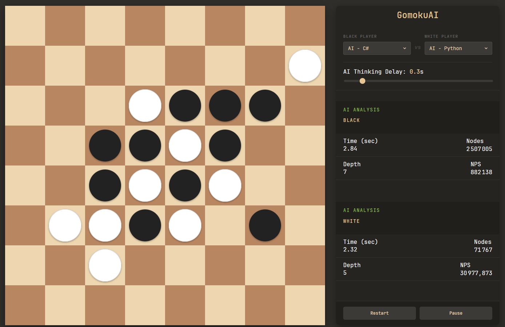

# GomokuAI


A modular Gomoku (Five in a Row) ecosystem featuring a dynamic web interface and two independent AI engines powered by **Python** and **C#**.

## Overview
GomokuAI is designed with a strict **decoupled architecture**. The project separates the game logic and user interface from the decision-making engines. This modularity allows any component—whether the UI or an AI engine—to be modified or replaced without affecting the rest of the system.

<p align="center">


## Architecture
The application consists of three distinct pillars that communicate via REST APIs:

1.  **Web Interface:** The central hub managing game rules and state.
2.  **Python AI:** An engine utilizing a Flask-based API.
3.  **C# AI:** An engine utilizing a .NET-based API.

### Communication Flow
The interface sends the current board state via an API request. The selected AI processes the move and returns the optimal coordinates through its entry point.

## Technical Stack

### Frontend (The Interface)
* **HTML5 / CSS3:** For a responsive and dynamic board display.
* **JavaScript (Vanilla):** Divided into specialized modules handling:
    * Gomoku game logic and win conditions.
    * Turn management and session state.
    * Application settings and API query handling.

### Backend (The Engines)
Both AI engines share a similar logic structure to ensure consistent competitive levels, despite being written in different languages:
* **Minimax Algorithm:** Used to explore the decision tree and anticipate future moves.
* **Heuristic Evaluation Function:** Scores specific board positions to determine the best strategic path.
* **APIs:** **Flask** for the Python implementation and **ASP.NET Core** for the C# implementation.

## Key Features
* **Independence:** Swap between the Python and C# AI mid-game to compare performance.
* **Performance:** Optimized evaluation functions designed for classic, reliable strategic gameplay.
* **Scalability:** The API-first approach makes it easy to plug in new AI models (e.g., Deep Learning) in the future.

## Project Conclusion
This project successfully met and exceeded all initial requirements. By applying established concepts such as Minimax and heuristic scoring—previously explored in Chess and Connect Four projects—this implementation focuses on high-quality code separation and robust inter-service communication.

## Installation & Usage

1. **Clone the repository**

```bash
git clone https://github.com/Aitaneuh/gomokuAI.git
cd gomokuAI
```

2. **Setup the Backend**

```bash
cd python
pip install flask
python server.py
```

```bash
cd csharp
dotnet run
```

3. **Launch the Web Interface**
Open `index.html` in your browser.
